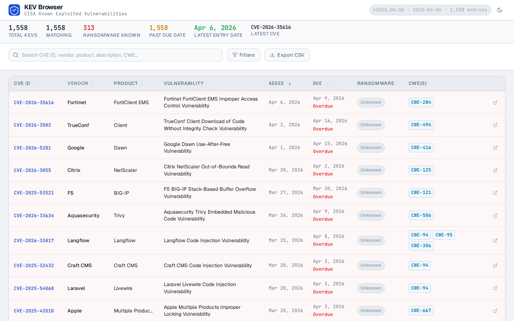
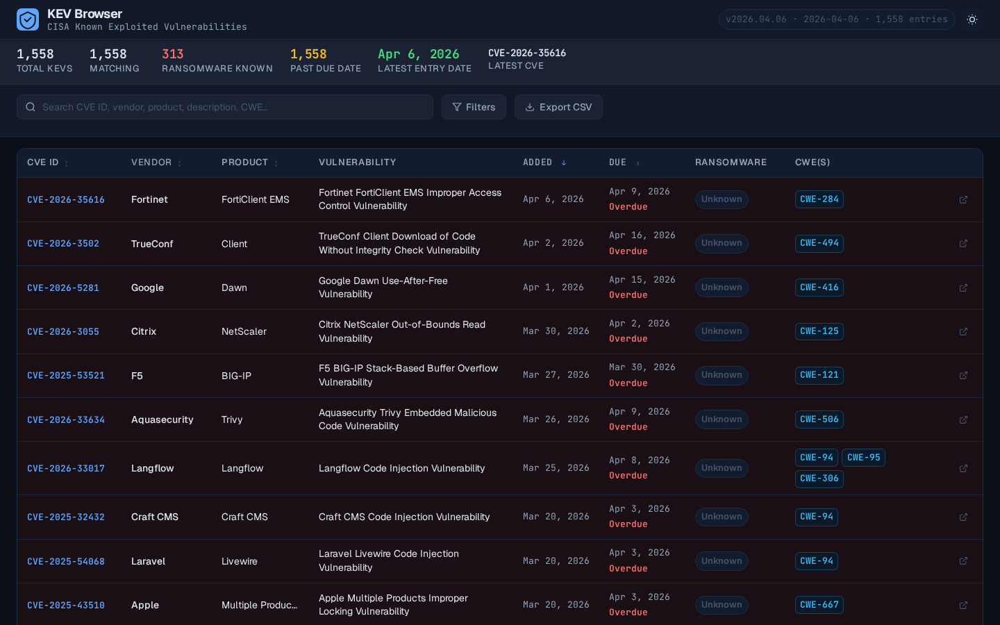
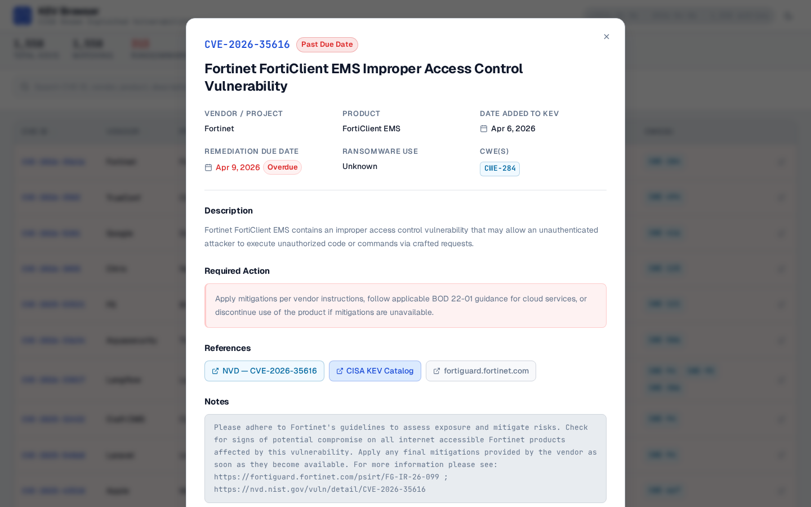

# 🛡️ CISA KEV Browser

> A fully **standalone, offline-capable** browser for the [CISA Known Exploited Vulnerabilities (KEV) Catalog](https://www.cisa.gov/known-exploited-vulnerabilities-catalog).  
> No server. No install. No dependencies. Just open `cisa-kev-browser.html` in any browser.

---

## Preview

**Main catalog view — dark mode** (newest CVE at the top, sortable columns, live stats bar)



**Main catalog view — light mode**



**Detail modal** — full metadata, required action, reference links, and prev/next navigation



---

## 📦 What's in this repo

| File | Purpose |
|------|---------|
| `build.py` | Fetches the latest KEV data from CISA and builds the standalone HTML |
| `cisa-kev-browser.html` | Self-contained app with all 1,558+ KEVs embedded — open directly in any browser |

---

## ⚡ Quick Start

**Step 1 — Update & build** (requires Python 3.7+ and internet):
```bash
python3 build.py
```

**Step 2 — Open the app:**
```bash
# macOS
open cisa-kev-browser.html

# Windows
start cisa-kev-browser.html

# Linux
xdg-open cisa-kev-browser.html
```

That's it. No `pip install`. No Node. No server.

---

## 🔄 How It Works

### `build.py` — The Data Pipeline

```
CISA CDN  ──[HTTPS + cache-bust headers]──▶  fetch_kev()
                                                │
                                       Validate payload
                                       (count check, non-empty)
                                                │
                                       Sort newest-first
                                                │
                                          build()
                                                │
                                    Inject JSON into HTML template
                                                │
                                    Write  cisa-kev-browser.html
```

**Cache-busting strategy** — CISA's CDN can serve stale responses. `build.py` defeats this with:
- Unique Unix timestamp appended to the URL: `?_=1744034291`
- Random nonce: `&nocache=873227`
- HTTP headers: `Cache-Control: no-cache, no-store, must-revalidate, max-age=0`
- `Pragma: no-cache` + `Expires: 0`
- Fresh SSL context on every request

**Validation** — after download, the script cross-checks the declared `count` field against the actual number of `vulnerabilities` entries received, and aborts if the payload appears truncated.

**Output** — the script prints the 3 newest entries so you can visually confirm freshness before opening the HTML:

```
=======================================================
  CISA KEV Browser — Data Updater
=======================================================

Fetching latest KEV data from CISA...
  URL: https://www.cisa.gov/...json?_=1744034291&nocache=873227
✓ Downloaded 1,558 vulnerabilities
  Catalog:  v2026.04.06  (released 2026-04-06)
  Newest entries:
    2026-04-06  CVE-2026-35616        Fortinet
    2026-04-02  CVE-2026-3502         TrueConf
    2026-04-01  CVE-2026-5281         Google

Building standalone HTML...

✓ Done!
  Output:  cisa-kev-browser.html
  Size:    1128 KB
  Built:   2026-04-07 10:05:33
```

---

### `cisa-kev-browser.html` — The App

All data is embedded inline as a JavaScript constant — no network calls needed at runtime.

```
Open cisa-kev-browser.html
        │
        ▼
  JS reads CATALOG const
  (embedded JSON, 1,558 KEVs)
        │
        ├── Populate vendor dropdown  (all unique vendors)
        ├── Populate CWE dropdown     (all unique CWEs, sorted)
        ├── Set "Latest Entry" stats  (newest CVE + date)
        └── applyFilters() → renderPage()
                                │
                         Display table (50/page)
```

---

## 🔍 Search & Filter Capabilities

| Filter | Description |
|--------|-------------|
| **Full-text search** | CVE ID, vendor, product, vulnerability name, description, CWE codes, notes |
| **Vendor / Project** | Dropdown of all vendors in the catalog |
| **Ransomware Use** | Known / Unknown campaign association |
| **CWE** | Filter by any specific Common Weakness Enumeration code |
| **Date Added From/To** | Date range filter on when the CVE was added to the KEV catalog |

---

## 📊 Sortable Columns

Click any column header to sort ascending or descending:

- CVE ID (alphanumeric)
- Vendor / Project
- Product
- Date Added *(default: newest first)*
- Due Date

---

## 📋 Detail View

Click any CVE ID or the ↗ icon to open a full detail modal:

- Full vulnerability name, vendor, product
- Date added to KEV + remediation due date (with overdue indicator)
- Ransomware campaign use status
- All associated CWEs (linked to MITRE)
- Full description
- Required action (highlighted red if overdue)
- Reference links: NVD, CISA catalog, vendor advisories
- Raw notes field
- Prev / Next navigation between CVEs
- Keyboard: `←` / `→` to navigate, `Esc` to close

---

## 📤 Export

**Export CSV** button exports the current filtered view (all matching records, not just current page) with columns:

`CVE ID, Vendor, Product, Vulnerability Name, Date Added, Due Date, Ransomware, CWEs, Short Description, Required Action`

---

## ⌨️ Keyboard Shortcuts

| Key | Action |
|-----|--------|
| `Ctrl/Cmd + K` | Focus search bar |
| `Esc` | Close detail modal |
| `←` | Previous CVE in modal |
| `→` | Next CVE in modal |

---

## 🎨 UI Features

- **Dark / light mode** — toggle in header, respects system preference on first load
- **Active filter chips** — removable at a glance
- **Overdue highlighting** — rows with past-due remediation dates highlighted in red
- **Due soon warning** — amber label for CVEs due within 14 days
- **Data age banner** — yellow warning shown automatically if embedded data is >30 days old

---

## 🔁 Keeping Data Current

CISA updates the KEV catalog several times per week. Just re-run:

```bash
python3 build.py
```

Then reload `cisa-kev-browser.html`. The footer always shows the embedded catalog version and release date.

---

## 📐 Architecture Diagram

```
┌─────────────────────────────────────────────────────────────┐
│                        build.py                             │
│                                                             │
│  ┌──────────┐    HTTPS     ┌─────────────────────────────┐ │
│  │          │◄────────────▶│   cisa.gov CDN              │ │
│  │fetch_kev │  cache-bust  │   known_exploited_          │ │
│  │          │   headers    │   vulnerabilities.json      │ │
│  └────┬─────┘              └─────────────────────────────┘ │
│       │                                                     │
│       │ validate + sort newest-first                        │
│       ▼                                                     │
│  ┌──────────┐                                              │
│  │ build()  │──── inject JSON into HTML template           │
│  └────┬─────┘                                              │
│       │                                                     │
│       ▼                                                     │
│  cisa-kev-browser.html  (fully self-contained)             │
└─────────────────────────────────────────────────────────────┘
                          │
                          │ open in browser
                          ▼
┌─────────────────────────────────────────────────────────────┐
│                  cisa-kev-browser.html                      │
│                                                             │
│  const CATALOG = { ...1,558 KEVs embedded... }             │
│          │                                                  │
│          ▼                                                  │
│  ┌───────────────┐   ┌────────────────┐                   │
│  │  Filter Panel  │   │  Stats Bar     │                   │
│  │  ─ text search │   │  ─ total       │                   │
│  │  ─ vendor      │   │  ─ matching    │                   │
│  │  ─ ransomware  │   │  ─ ransomware  │                   │
│  │  ─ CWE         │   │  ─ overdue     │                   │
│  │  ─ date range  │   │  ─ latest CVE  │                   │
│  └───────┬───────┘   └────────────────┘                   │
│          │                                                  │
│          ▼ applyFilters() + sort                           │
│  ┌───────────────────────────────────┐                     │
│  │         Data Table (50/page)      │                     │
│  │  CVE ID │ Vendor │ Product │ ...  │                     │
│  │  ───────┼────────┼─────────┼───  │                     │
│  │  click CVE → Detail Modal         │                     │
│  └───────────────────────────────────┘                     │
│                                                             │
│  ┌──────────────────────────┐                              │
│  │   Detail Modal           │                              │
│  │   Full metadata + refs   │                              │
│  │   ← prev / next →        │                              │
│  └──────────────────────────┘                              │
│                                                             │
│  [ Export CSV ]  ← filtered view, all pages               │
└─────────────────────────────────────────────────────────────┘
```

---

## 📎 Data Source

| Field | Value |
|-------|-------|
| Source | [CISA Known Exploited Vulnerabilities Catalog](https://www.cisa.gov/known-exploited-vulnerabilities-catalog) |
| JSON Feed | `https://www.cisa.gov/sites/default/files/feeds/known_exploited_vulnerabilities.json` |
| Schema | [CISA KEV JSON Schema](https://www.cisa.gov/sites/default/files/feeds/known_exploited_vulnerabilities_schema.json) |
| Update frequency | Multiple times per week |

---

## ⚖️ Disclaimer

This tool is an independent community utility. It is not affiliated with, endorsed by, or produced by CISA or the U.S. Government. Always refer to the [official CISA KEV catalog](https://www.cisa.gov/known-exploited-vulnerabilities-catalog) for authoritative information.
